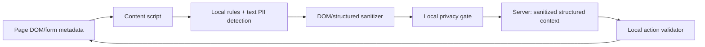
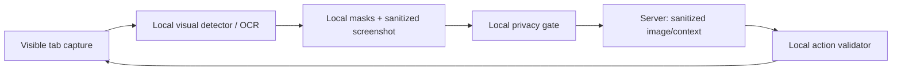
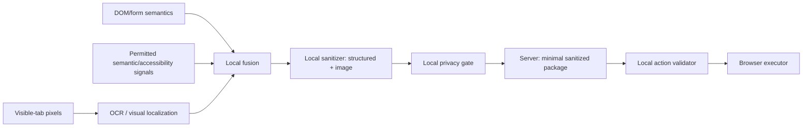

# Architecture Options

These are conceptual candidates, not rankings or approved implementations. All must meet the confirmed local-sanitization and local-action-validation requirements.

## Candidate A — DOM-first local privacy architecture

**Suitable when:** supported pages expose semantically complete, permission-accessible DOM and the task does not depend on visual-only content.

**Weak when:** PII is rendered into images, canvas, video, cross-origin content, or inaccessible UI; visual-layout context drives the task.

**Runtime implication:** lower pixel/inference cost; still needs a local ViT/equivalent contribution for the confirmed screen-vision requirement.

**Requires validation:** DOM-to-rendered-state coverage, shadow/cross-origin frames, visual-only PII recall, and browser-page restrictions.

**Status:** PROPOSED.

## Candidate B — screenshot/vision-first local privacy architecture

**Suitable when:** the relevant information is visual, rendered outside the DOM, or layout/appearance is central.

**Weak when:** capture permission/rate, browser restrictions, model latency, small text, and visually ambiguous PII reduce coverage; raw captures are a high-risk local artifact.

**Runtime implication:** stronger demand for local localization/OCR and tested WebGPU/WASM fallback.

**Requires validation:** mask coverage, OCR residual leakage, high-resolution localization, capture rate/resource impact, and Chrome/Firefox capture behavior.

**Status:** PROPOSED.

## Candidate C — hybrid DOM + semantic signals + OCR + lightweight vision

**Suitable when:** browser tasks need both semantic structure and visual coverage, especially for text rendered outside normal DOM and action-target grounding.

**Weak when:** fusion disagreement increases complexity, attack surface, resource cost, and benchmark requirements.

**Runtime implication:** permits capability-specific local components; does not imply a single model performs every function.

**Requires validation:** marginal benefit of each signal, fusion conflict policy, end-to-end resource/latency, and privacy leakage across every representation.

**Status:** PROPOSED.

## Server package options

| Package | Privacy exposure | Reasoning utility | Latency/bandwidth | Status |
| --- | --- | --- | --- | --- |
| Sanitized structured DOM/context | Lower if values and identifiers are removed. | Strong semantic roles; weak visual appearance. | Usually compact. | PROPOSED. |
| Sanitized screenshot | Depends on complete redaction and residual visual identifiers. | Preserves layout and visual state. | Image cost; capture/redaction needed. | PROPOSED. |
| Sanitized screenshot + structure | Higher composite exposure; may improve grounding. | Strongest candidate utility. | More bandwidth and gate complexity. | PROPOSED. |
| Sanitized screenshot + OCR | OCR can reintroduce sensitive text if not separately sanitized. | Helps text interpretation. | Medium. | PROPOSED. |
| Abstract structured browser state | Lower if schema is narrow. | Limited appearance and unknown-page coverage. | Low. | PROPOSED. |

No package is approved until an outbound schema, leakage tests, and task-utility benchmark exist.

