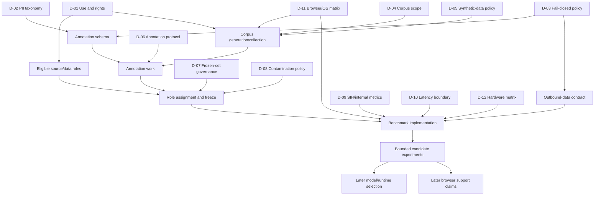

# Decision Dependency Graph

**Status:** `OWNER-APPROVED DEPENDENCY MAP`. It records the Prompt 5 decisions and separates remaining benchmark work from unresolved official SIH evidence.

## What each decision blocks

| Decision | Blocks now | Can proceed before resolution |
| --- | --- | --- |
| D-01 Use and rights | Assigning external candidates to train/validation/frozen roles; distributing derived data | Metadata audit, synthetic schema design, public-source research |
| D-02 PII taxonomy | Stable class schema and category-level privacy metrics | Tool-neutral storage schema and page/capture design |
| D-03 Fail-closed policy | Outbound contract, uncertainty labels, privacy-gate acceptance cases | Local corpus capture with no outbound release |
| D-04 Corpus scope | Final page/browser/condition sampling frame | Generator and annotation-tool design against representative mock cases |
| D-05 Synthetic policy | Role eligibility and composition of generated data | Generator requirements and lineage schema |
| D-06 Annotation protocol | Production annotation and quality acceptance | Pilot instructions clearly marked draft |
| D-07 Frozen governance | Freezing and scoring the final evaluation set | Training/validation/demo role planning |
| D-08 Contamination policy | Final role assignment and release of a frozen version | Candidate scans using unapproved exploratory flags |
| D-09 Metric formulas/authority | Official or owner-approved scoring implementation | Raw prediction and ground-truth schema design |
| D-10 Latency boundary | Primary end-to-end score | Per-stage instrumentation design |
| D-11 Browser/OS matrix | Compatibility claims and reproducible browser benchmark | Browser-neutral schemas and single-environment prototypes later authorized |
| D-12 Hardware matrix | Resource/latency comparison claims | Instrumentation fields and workload specification |

## Prompt 5 decision result

D-01 through D-07 and D-09 through D-12 are resolved at project-policy level by the owner response. D-08 is policy-approved but remains benchmark-dependent for operational thresholds. Prompt 6 is no longer blocked on owner scope decisions; it is bounded by the approved Chrome/Windows, synthetic-first, rights-reviewed scope.

## Blocking decisions for Prompt 6

Prompt 6 may now produce an executable corpus/benchmark work plan using the recorded decisions. It must still resolve or explicitly version:

- exact rights-cleared dataset assignments and exclusions under D-01;
- corpus, annotation, contamination, and platform version identifiers;
- operational contamination thresholds under D-08;
- internal aggregation and run-validity details while official SIH definitions remain unknown;
- exact browser/OS/hardware/runtime metadata for each run.

Answers may explicitly defer branches. For example, an owner-approved Chrome/Windows first matrix can unblock a bounded first benchmark while Firefox remains a later compatibility gate.

## Non-blocking decisions that may be deferred

- commercial-use compatibility when the approved immediate use excludes it and no asset is reused for that purpose;
- redistribution format when all generated or transformed data remains local;
- additional OS/browser combinations outside the first approved matrix;
- exact production support claims, final performance thresholds, and deployment requirements;
- real-person data collection when the approved corpus uses synthetic or controlled non-personal content;
- WebNN, WebGL, or other runtime paths outside the first experimental matrix;
- final model, OCR engine, runtime, quantization, inference schedule, and architecture selection, all of which remain benchmark-dependent.

## Later claims

Corpus generation and annotation evidence do not by themselves authorize model training. Benchmark completion does not by itself establish production browser support. Model/runtime selection and compatibility claims require their own later gates based on approved frozen results and traceable platform evidence.

## Prompt 6 work-package dependencies

`prompt6-experimental-plan.md` operationalizes this graph. WP-01 through WP-08 must progress in order for affected artifacts: blueprint, generation, capture, annotation, QA, contamination, role/freeze, then harness qualification. Development baselines may use qualified training/validation fixtures after Gates A–D; frozen results and selection claims require the additional frozen-build controls.
