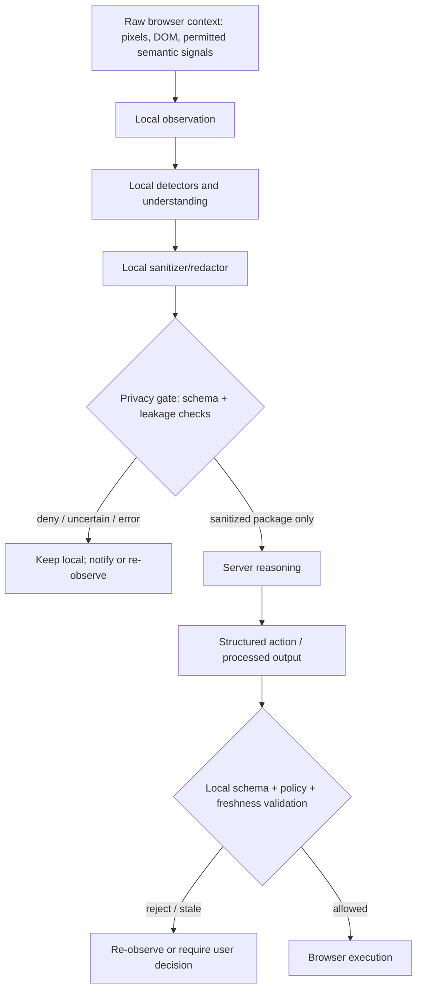

# System Architecture Foundation

**Prompt 3 status:** decision foundation only. No final architecture is selected.

## Decision states

- **CONFIRMED:** supported by SIH/user requirements or verified technical documentation.
- **PROPOSED:** technically reasoned design needing approval and benchmarks.
- **OWNER-REQUIRED:** cannot be resolved from current evidence.
- **UNKNOWN:** fact or compatibility detail not yet verified.
- **BENCHMARK-DEPENDENT:** choice must wait for approved experiments.

## Authoritative constraints and architectural effect

| Requirement / constraint | Status | Evidence | Architecture impact |
| --- | --- | --- | --- |
| Local browser vision evaluates screen state. | CONFIRMED | FR-002; SIH26171. | A local visual component is required, but its model family and responsibility remain open. |
| Sensitive visual/textual context is dynamically sanitized before relevant network requests. | CONFIRMED | FR-003, FR-008. | Detection and sanitization must happen before any server-bound representation is serialized. |
| Only anonymized/unidentifiable context may leave. | CONFIRMED | FR-004, PR-001. | Requires an explicit local outbound-control boundary, not merely a sanitization function. |
| Server reasoning returns processed data or browser actions. | CONFIRMED | FR-005. | Server contract must be structured and carry no raw context. |
| Client validates actions before execution. | CONFIRMED | FR-006. | Action schema and local policy are separate from server reasoning. |
| Chrome and Firefox are named. | CONFIRMED | BR-001. | Browser-specific capability tests and fallback paths are required before support claims. |
| Five weighted SIH dimensions total 100%. | CONFIRMED | EV-001. | Candidate designs must expose benchmark hooks for accuracy, privacy, resources, and latency. |
| Formulas, thresholds, devices, versions, and aggregation. | OWNER-REQUIRED | EV-002; Prompt 2. | No candidate can be ranked or accepted numerically yet. |

## Role decomposition

| Role | Inputs | Permitted outputs | Boundary / validation | Status |
| --- | --- | --- | --- | --- |
| Page/content context | DOM, rendered UI, page events. | Local observations only. | Treat page input as untrusted; no privileged action from page messages. | CONFIRMED boundary need; exact interfaces PROPOSED. |
| Extension content script | Permitted page DOM and local commands. | Narrow local observation/action messages. | Host permission and message-schema checks. | CONFIRMED capability; interface PROPOSED. |
| Background/service-worker coordinator | Sanitized local messages, user gesture/permissions. | Local orchestration; outbound call only through gate. | Must not receive/export raw data outside approved path. | PROPOSED. |
| Local inference and detection | Local pixels/DOM/accessibility-derived text. | Detection regions, spans, confidence, sanitized representations. | No direct network privilege. | PROPOSED separation. |
| Sanitizer and privacy gate | Raw local context plus detections. | Schema-valid sanitized package or deny decision. | Gate is the last local authority before egress. | CONFIRMED objective; fail-closed behavior PROPOSED. |
| Server reasoning | Sanitized package only. | Structured action or processed result. | Contract/schema validation on receipt and response. | CONFIRMED role; payload format PROPOSED. |
| Local action validator/executor | Server action and current local observation. | Allowed browser action, re-observation request, or reject. | Never trust server action as authorization. | CONFIRMED local validation; policy PROPOSED. |

## Candidate privacy pipeline

The overall local-before-server sequence is **CONFIRMED**. The dedicated gate, deny behavior, message types, and component isolation are **PROPOSED** until a threat model and implementation tests exist.

## Locality and failure policy

| Situation | Required locality | Proposed safe behavior | Decision state |
| --- | --- | --- | --- |
| Raw screenshot/DOM/accessibility/form value contains protected data | Local | Do not serialize it to server. | CONFIRMED locality; enforcement method PROPOSED. |
| Detector uncertainty or unsupported visual content | Local | Deny server export, request narrower scope or user decision. | PROPOSED fail-closed policy. |
| Sanitizer failure, timeout, crash, or schema mismatch | Local | Deny outbound package and record non-sensitive diagnostic code. | PROPOSED. |
| Local inference timeout | Local | Cancel/deny export or use an approved narrower local fallback. | OWNER-REQUIRED for UX policy. |
| Server timeout or malformed response | Local | Do not execute; retain no additional raw context. | PROPOSED. |
| Action target changes after server response | Local | Reject and re-observe rather than coordinate-click. | PROPOSED. |

## What may cross the boundary

Only an approved sanitized representation may cross. Candidate representations are compared in [`architecture-options.md`](architecture-options.md). Raw pixels, original OCR/DOM/accessibility strings, credentials, tokens, account identifiers, raw browser state, and unreviewed derived fields must remain local where present. The exact allowlist, placeholder semantics, coordinate policy, retention, and provider controls are **OWNER-REQUIRED**.

